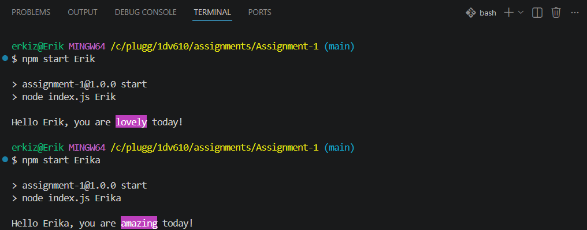

# Reflektion: Laboration 1 – Fortsätt programmera
## 1. Att fortsätta programmera

*Vilka kunskaper och färdigheter från tidigare kurser bygger du vidare på i den här uppgiften? Vad var mest utmanande? Vad vill du utveckla vidare i din programmering framöver?*

Svar: 
Det var inte mycket nytt eller utmanande för den här uppgiften. process.argv samt paketinstallering är båda saker som vi har gjort i tidigare årskurs. Skulle kunna arbetat vidare med ett välkomstmeddelande sedan att man enbart fyller i ett namn istället för att behöva skriva npm start. Just nu hanterar även bara programmet namn utan mellanslag.

Jag vill arbeta vidare med agentisk kodning och tynge användning av AI i framtiden. Jag använde mig inte särskilt mycket av det i första årskursen men efter att ha pratat med alumni samt personer i industrin så verkar det vara väldigt förekommande.

## 2. Arbetsflödet

*Hur kändes det att arbeta med Git och använda kursens plattformar?*

Svar: Är lite smådrygt att pusha till både github och gitlab samtidigt. Sätter troligtvis upp ett skript för att göra en commit och push till båda två om inlämningarna ska fortsätta vara på gitlab men github är det som rekommenderas.

*Varför valde du GitLab eller GitHub för din kod? Vad vägde du in — till exempel integritet, att bygga en publik portfolio, eller vana? Om GitHub — länk till ditt repo:*

Svar: Valde Github för det rekommenderades i uppgiften och stod som krav i framtida workshops så är väl lika bra att börja med det. Lade till gitlab som remote för att kunna commita och pusha till båda då inlämningen måste ske där.
https://github.com/225nm/1DV610-Laboration-1

## 3. Bedömning och att dela publikt

*Uppgiften bedöms inte på kodens stil eller kvalitet, bara på en komplett inlämning. Påverkade det hur du arbetade? Och hur kändes det att posta din skärmdump/video publikt i Zulip, utan möjlighet att göra det privat?*

Svar: Det påverkar inte arbetet och att posta resultatet publikt är inga problem.

## 4. Ditt program

*Vilket programmeringsspråk valde du, och varför just det?*

Svar: Javascript då det är språket jag har mest erfarenhet och är bekvämast med.

*Vad gjorde du för att göra välkomstmeddelandet till något mer än bara `"Hej " + namn`?*

Svar: Jag lade till en slumpmässig komplimang som markeras i rosa med paketet Chalk.

## 5. AI-samarbete

*Samarbetade du med någon AI-assistent (t.ex. ChatGPT, GitHub Copilot, Claude) — som en kollega snarare än bara ett verktyg? Beskriv kort hur, och ge gärna ett exempel på en prompt som gav ett bra resultat.*

Svar: För den här lilla uppgiften hade jag bara ett ChatGPT-fönster uppe i en webbläsare för att ställa lite frågor nu efter sommaren när det inte är färskt i minnet. Frågor jag ställde var t.ex. vad som ska inkluderas i min gitignore och package.json och copilot fyllde i några komplimanger och standard syntax när jag började skriva dessa.

## 6. Bild eller video

*Bifoga (eller länka till) samma skärmdump/video som du postat i Zulip.*

Svar: 
